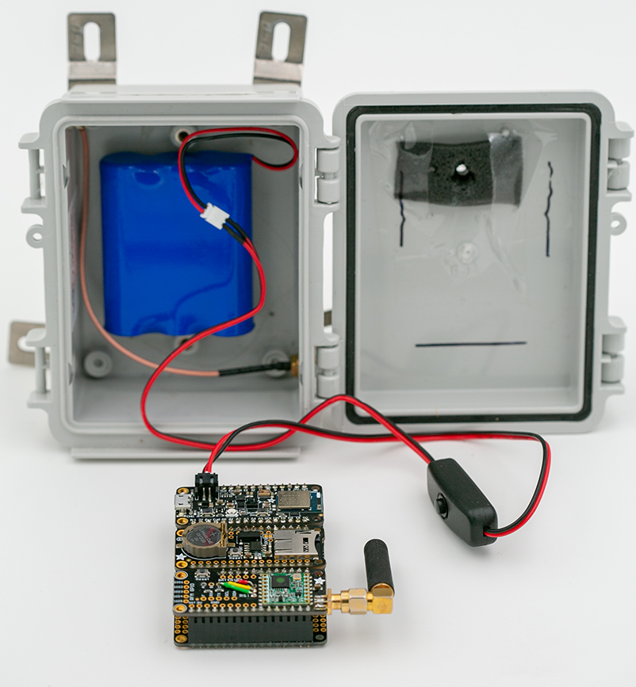

# Design Considerations

The project goal is to be able to count the number of times sirens are heard over a number of weeks. This gives us some obvious requirements to start with:
-	We need to be able to continuously listen for sirens. If we sample only once a minute, we might miss a fire truck diving by.
-	We need for the battery to last for multiple weeks. This means keeping the power draw low and maybe finding a way to recharge the batteries to extend the run time.
-	Accuracy is important… but not critical since we are generating higher level statistics. 
-  However, it would be good to have a method for validating results.

Given that power is a concern and we do not need 99.99% accuracy, this seems like a great job for TinyML!

With these high level requirements, let’s dive into the different design considerations on both the hardware and software side.

## Model Accuracy
When you are designing a system with multiple components, it is important to have well defined objectives. There are always a number of design trade-offs that will be encountered and it is necessary to have those higher level objectives to optimize for. When it comes to ML, accuracy should almost always be one of those. While having better accuracy would always seem like a good thing, there is a point where further improvements can mean making some very real sacrifices. It is much better to focus on how accurate the system need to be in order to be effective. In many cases, 100% accuracy is not needed, and in fact 80% accuracy may be good enough, especially if the overall system is designed with this in mind. 

When it comes to surveying sources of urban noise over time, it is not necessary to have 100% accuracy. The goal is to identify continual, long-term annoyances. Occasional misidentifications will also be averaged out overtime. 

However, there are also cases when the objective is looking for a single type of sound that signifies a specific event. This could be breaking glass, a baby crying, or a gun shot. In these cases, accuracy is much more important because the goal is not to miss a single event. 

For this project, if we can the model accuracy over 80% it should be given us a good sense of when sirens are prevalent. We can also do some additional processing on the results from the ML model to further improve accuracy, for instance, only accepting multiple detections in a row.

## Model Size
While model size very important in traditional ML, it is a critical component for running ML models on embedded devices. These devices have very limited memory, storage and processing power. There are optimizations that can be applied to reduce model size and complexity, but there are limits on how much can be squeezed. Ultimately, these constraints need to be specifically targeted when designing a model. One parameter influences this, is how complex the output from the model is. A model that just provides a yes/no answer will be simpler than one of equal accuracy that can differentiate between ten different classes. When there is a tight constraint on model size, you can expect models with simpler outputs to be more accurate than ones with richer outputs. However, as noted above, depending on your design objectives, this maybe fine.

Our model will just be providing a yes/no answer to whether a siren was heard, so it should be possible to create a model that meets the hardware constraints.

## Analysis Techniques
When it comes to sounds, it can help to divide them up into single instance and continuous sounds. An action or event will generate one or the other type. A baby crying is continuous event. As a parent I can attest that these events can go on for a long time. The same is true for leaf blowing. However, the sound of glass breaking may only last for a very short amount of time. 

When trying to classify audio, your device will be continually collecting audio and analyzing it. If the goal is to perform a survey, the sensor may sleep in between samples. It is important to keep in mind which type of sound you are targeted when you begin to look at the length of audio you will be sampling and how frequently these samples will be collected. The amount of processing and memory available on your embedded platform will limit both of these elements. For continuous sounds, having a longer sample length can help in identifying and make it less likely to be confused with similar, shorter sounds. However, if the goal is to detect short instances, it is more important to be continually collecting samples so that events are not missed.

If the memory requirements for a model are kept low enough, it is possible to use a double buffer. This allows for audio to be continually analyzed. One buffer is used for recording, while inference is being performed on the other. If the time it takes to performance inference is less than the recording sample length, audio can be continuously analyzed. However, if the model is complex or there is limited processing power available and inference last longer than the sample length, there will still be gaps of audio that do not get analyzed. 

If the sound you are looking for is not continual, there is a chance it may end up being split between consecutive samples. This is especially true if audio is not being continuously sampled. Windowing can help prevent this by using a sliding window that overlaps samples and averages the results. 

Edge Impulse has a [great breakdown](https://docs.edgeimpulse.com/docs/continuous-audio-sampling) of these different techniques.

This project will be focus on monitoring for sirens, which are for the most part are a continual sound. It would be fine if there are some gaps in the audio being processed, but continually processing audio will allow us to collect more samples. As we will see, having multiple contiguous detections is a strong indicator of a siren.

## Recording Sample Rate

There are a number of parameters you need to configure when you take an analog signal, like the one coming from a microphone, and digitize it into a series of 1’s & 0’s. These parameters determine how much detail from the analog signal is captured. As you can guess, there are trade-offs here too. While it seems like a good idea to capture as much detail as possible, that results in a more data and it requires more storage, memory and compute to run it through a model. Given the limited amount of all of these on a microcontroller, it is best to aim for the minimum amount of signal detail before accuracy takes a serious nose dive. Success here is about finding a good enough set of parameters.

There are 2 general parameters when it comes to digitizing an analog signal. They are the Sample Rate and Resolution. The Sample Rate is how many times a second a sample of the analog signal is captured. With enough sampling, these discrete elements combine together to approximate a continuous analog signal. The Sample Resolution is the precision used for the sample. It is generally measured by the number of bits used. An 8-bit sample provides only 256 unique values, while a 16-bit sample can provide 65,536 different values. 

It is good to remember that it is easy to take high quality audio and reduce the sampling rate and resolution later on. When you are capturing training data, aim to capture it at the highest possible quality you could use in your system. You can then downsample to different rates and look at the impact on accuracy.

Since we are targeting sirens, which are designed to be distinct and obvious, it is likely we will not need very high-quality audio to have an accurate system.

## ML Framework
Tensorflow has a good ecosystem for creating ML models that can be run on microcontrollers. It is an extension of Tensorflow Lite called [Tensorflow Lite for Microcontrollers](https://www.tensorflow.org/lite/microcontrollers). This is a bit of a mouth full, so I will shorten it to TF Micro. What sets this apart from other efforts, which are largely research, is that software developers, hardware manufacturers and ML researchers are all participating. While TinyML is a generic terms that covers running ML on microcontrollers, it generally refers to TF Micro. 

## Datasets
In order to train an ML model, you need data that has been labeled with the prediction you want to the model to learn. Luckily, there already exists a lot of labeled audio data. The SONYC effort I mentioned above has hours of labeled data and sirens is one of the labels used. There are also datasets that just have general background sounds. This provides a variety of examples of things that are not sirens for the model to learn.

Having an initial model that sort of works, can help you more intelligently capture sounds in wild to further refine the model. If you simply left a audio recorder on for 24/7, you would end up with a lot of audio to label, but very little of it would improve the model. This is especially true, because sirens are not that common. With an initial model, you can run your recorded audio through it and throw away all of the samples where the model is very confident there is no siren present. 

## Microcontroller
There is a lot that can be written about microcontrollers, but my background is on the software side so I will just give you the basics that I have picked up along the way. Almost all of the processors use an ARM architecture and instruction set. There are different classes and versions of processors. Most of the current boards use am ARM v6/7 architecture. You will see them mentioning having an ARM Cortex M0 or M4 processor. There are also Cortex M1 & M3 processors, but I haven’t seen them around much. M0 based processors are simpler and use less power. They do not have hardware support for floating point math or have hardware acceleration. The M4 based chips are more powerful and have hardware support for floating point, along with hardware acceleration for some common ML operations. The next generation of ARM cores is based on the ARM v8 instruction set, but I haven’t seen them show up in many development boards yet.

Cortex M4 based processors offer a great balance of performance and power usage.  They are fast enough to handle image and audio recognition tasks but can still be battery powered. Since they have been around for a while, there is good software support. Best of all, they are also pretty cheap.

## Programming
While almost all of the processors in the microcontroller space use an ARM based design, there are a lot of differences in how they are configured and interact with peripherals. Processor manufacturers provide tool chains that are written specifically for their family of chips and offer you the most control. The tools all generally use some variant of C/C++, but you have to be familiar with the different conventions of each family of processors.

Arduino provides a “standard” API that works across many different families of processors. Support has been added for most popular development boards. While C/C++ is still used, a lot of the manufacturer specific conventions get abstracted away. This makes it easier to switch from one family of processors to another. There is a large collection of 3rd party libraries that have been written and they can handle most common tasks. 

TF Micro can compile binaries for a number of different platforms and boards. These include Sony’s Spresense, Ambiq’s Apollo3, STM32, OpenMVCam and Mbed, among others. Luckily, TF Micro also supports building binaries for Arduino. This lets you take advantage of the hardware abstraction that is built into Arduino. Mbed offers a lot of similar benefits, but is mostly supported by the official development boards from the processor manufacturers and not the more interesting boards that Sparkfun and Adafruit make.

For this project, I am going to be using Arduino to program the microcontroller. It gives more flexibility around what development board can be used and there are lots of 3rd party libraries. 

### [Next Chapter: Building a Sensor](./build.md)